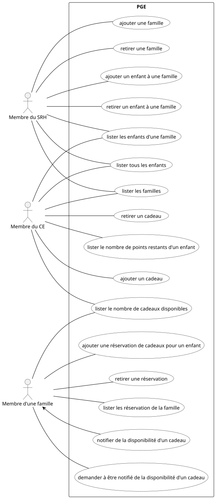
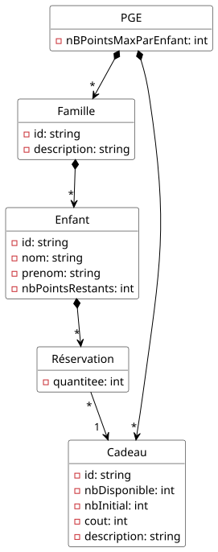
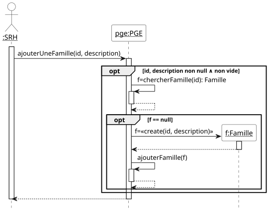
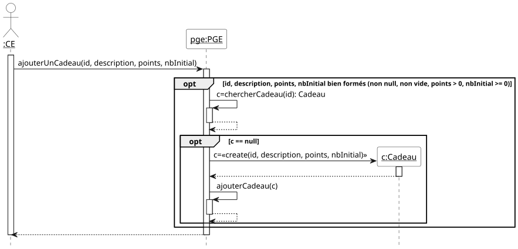
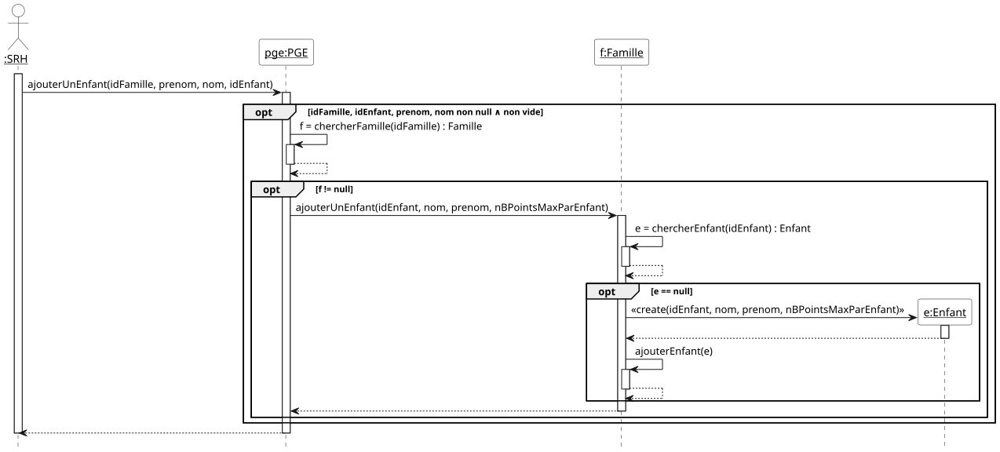
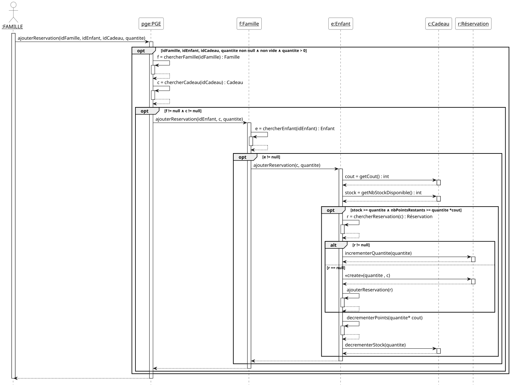
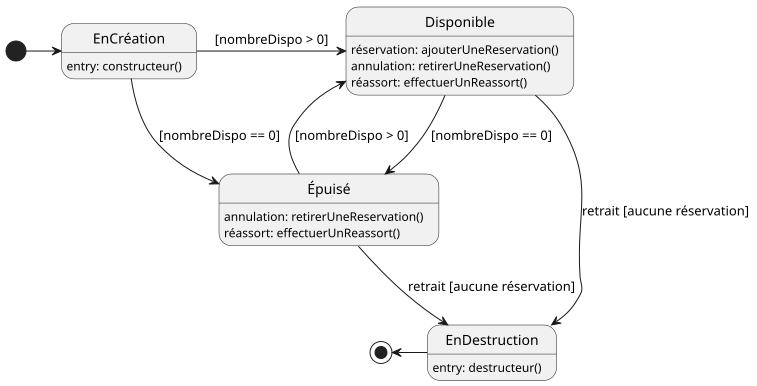

Membres du projet : 
- BELMAAZIZ Yasmine
- TAS Ozgur


# Petits cadeaux pour Grands Effets

## 1. Spécification

### 1.1. Acteurs et cas d'utilisation

**La première étape** consiste à **bien comprendre le système** à
étudier. Dans le cadre de l'exercice, cela consiste à lire
attentivement l'énoncé. Cette lecture doit permettre de *délimiter les
contours du système* à réaliser. La méthode générale consiste à
retrouver les acteurs qui interagissent avec lui. Il est très
important de fixer des frontières au problème. Ensuite, nous
recherchons les fonctionnalités du système par la définition de ses
cas d'utilisation. Dans le cadre de ce module, il s'agit de rechercher
les principales fonctions attendues du système. Nous nous limitons aux
cas d'utilisation pour atteindre les premiers objectifs indiqués dans
le cahier des charges, en prenant en considération les simplifications
énoncées dans le cahier des charges.

Pour réaliser le diagramme de cas d'utilisation à partir de l'analyse
du texte :
* rechercher les acteurs, avec les potentielles relation de
  généralisation spécialisation,
* rechercher les fonctionnalités du système accessibles aux acteurs

Voici ci-dessous le diagramme de cas d'utilisation avec les cas
d'utilisation les plus importants puis un second diagramme de cas
d'utilisation avec des cas d'utilisation moins importants, et donc que
nous ne développerons pas dans le cadre du temps imparti.

 \
Figure 1 : Diagrammes des cas d'utilisation

### 1.2. Priorités, préconditions et postconditions des cas d'utilisation

Les priorités des cas d'utilisation sont choisies avec les règles de
bon sens suivantes:

* pour retirer une entité du système, elle doit y être. La priorité de
l'ajout est donc supérieure ou égale à la priorité du retrait ;

* pour lister les entités d'un type donné, elles doivent y être. La
priorité de l'ajout est donc supérieure ou égale à la priorité du
listage ;

* il est *a priori* possible, c.-à-d. sans raison contraire, de
démontrer la mise en œuvre d'un sous-ensemble des fonctionnalités du
système, et plus particulièrement la prise en compte des principales
règles de gestion, sans les retraits ou les listages ;

* la possibilité de lister aide au déverminage de l'application
pendant l'exécution des tests de validation ;

Par conséquent, les cas d'utilisation d'ajout sont *a priori* de
priorité « HAUTE », ceux de listage de priorité « Moyenne», et ceux de
retrait de priorité « basse ».

Voici les précondition et postcondition des cas d'utilisation de
priorité HAUTE.

#### Ajouter une famille (HAUTE)

- en entrée : identificateur de la famille, description
- en sortie : /

- précondition : \
∧ identificateur bien formé (non null ∧ non vide) \
∧ description bien formé (non null ∧ non vide) \
∧ pas de famille avec cet identificateur

- postcondition : \
∧ ajout de la famille effectué

#### Retirer une famille (HAUTE)

- en entrée : identificateur de la famille
- en sortie : /

- précondition : \
∧ identificateur bien formé (non null ∧ non vide) \
∧ il existe une famille avec cet identificateur

- postcondition : \
∧ retrait de la famille effectué \
∧ retrait des enfants de la famille effectué

#### Ajouter un enfant (HAUTE)

- en entrée : identificateur de la famille, prénom de l'enfant, nom de l'enfant, id enfant
- en sortie : /

- précondition : \
∧ identificateur famille bien formé (non null ∧ non vide) \
∧ identificateur enfant bien formé (non null ∧ non vide) \
∧ prénom enfant bien formé (non null ∧ non vide) \
∧ nom enfant bien formé (non null ∧ non vide) \
∧ il existe une famille avec cet identificateur \
∧ l'enfant n'existe pas

- postcondition :\
∧ ajout de l'enfant dans la famille \
∧ le solde de points de l'enfant est initialisé

#### Retirer un enfant (HAUTE)

- en entrée : id enfant
- en sortie : /

- précondition : \
∧ id enfant bien formé (non null ∧ non vide) \
∧ l'enfant existe

- postcondition :\
∧ retrait de l'enfant dans la famille \
∧ toutes les réservations de cadeaux associées à cet enfant sont retirées \
∧ le stock des cadeaux concernés est ré-incrémenté

#### Ajouter un cadeau (HAUTE)

- en entrée : id cadeau, description, nombre de points, stock initial
- en sortie : /

- précondition : \
∧ id cadeau bien formé (non null ∧ non vide) \
∧ description bien formée (non null ∧ non vide) \
∧ le cadeau n'existe pas\
∧ nombre de points bien formée (non null ∧ non vide ∧ > 0) \
∧ stock initial bien formée (non null ∧ non vide ∧ >= 0)

- postcondition : \
∧ ajout du cadeau au catalogue effectué 

#### Retirer un cadeau (HAUTE)

- en entrée : id cadeau
- en sortie : /
`
- précondition : \
∧ id cadeau bien formé (non null ∧ non vide) \
∧ le cadeau existe \
∧ il n'existe aucune réservation en cours pour le cadeau

- postcondition :\
∧ retrait du cadeau au catalogue effectué 

#### Ajouter une réservation d'un cadeau (HAUTE)

- en entrée : id enfant, id cadeau, quantitée voulue
- en sortie : /

- précondition : \
∧ identifacteur enfant bien formé (non null ∧ non vide) \
∧ identifacteur cadeau bien formé (non null ∧ non vide)\
∧ quantitée bien formée (non null ∧ non vide ∧ >0)\
∧ l'enfant existe\
∧ le cadeau existe\
∧ le stock disponible pour ce cadeau >= la quantitée voulue\
∧ l'enfant possède un solde de points suffisant >= quantité*coût en points du cadeau

- postcondition : \
∧ le stock du cadeau est décrémenté par la quantité réservée \
∧ le solde de points de l'enfant est décrémenté du nombre de points correspondant \
∧ si réservation existante : quantité mise à jour \
∧ si aucune réservation pour ce couple (enfant , cadeau) : création de la réservation

#### Retirer une réservation d'un cadeau (HAUTE)

- en entrée : id enfant, id cadeau, quantitée à retirer
- en sortie : /

- précondition : \
∧ identificateur enfant bien formé (non null ∧ non vide) \
∧ identificateur cadeau bien formé (non null ∧ non vide) \
∧ quantitée bien formée (non null ∧ non vide ∧ >0) \
∧ l'enfant existe\
∧ le cadeau existe \
∧ la réservation pour ce couple (enfant, cadeau) existe \
∧ quantité déjà réservée >= quantité à retirer

- postcondition : \
∧ solde de points de l'enfant recrédité \
∧ stock du cadeau incrémenté \
∧ quantité réservée décrémentée \
∧ si quantité réservée atteint 0 : suppression de la réservation


#### Autres cas d'utilisation et leur priorité respective

- lister les familles (Moyenne)
- lister les enfants d'une famille (Moyenne)
- lister tous les enfants (Moyenne)

- lister le nombre de cadeaux disponibles (Moyenne)
- lister le nombre de points restants d'un enfant (Moyenne)

- lister les réservations réalisées (Moyenne)
- lister les cadeaux disponibles (Moyenne)

- (plus tard) efectuer un réassort (Basse)
- (plus tard) système de notifications (Basse)

## 2. Préparation des tests de validation des cas d'utilisation

#### Ajouter une famille (HAUTE)

|                                                 | 1 | 2 | 3 | 4 |
|:------------------------------------------------|:--|:--|:--|---|
| identificateur bien formé (non null ∧ non vide) | F | T | T | T |
| description bien formée  (non null ∧ non vide)  |   | F | T | T |
| pas de famille avec cet identificateur          |   |   | F | T |
|                                                 |   |   |   |   |
| ajout de la famille effectué                    | F | F | F | T |
|                                                 |   |   |   |   |
| nombre de tests dans le jeu de tests            | 2 | 2 | 1 | 1 |


#### Retirer une famille (HAUTE)

|                                                 | 1 | 2 | 3 |
|:------------------------------------------------|:--|:--|:--|
| identificateur bien formé (non null ∧ non vide) | F | T | T |
| il existe une famille avec cet identificateur   |   | F | T |
|                                                 |   |   |   |
| retrait de la famille effectué                  | F | F | T |
| retrait des enfants de la famille effectué      |   |   | T |
|                                                 |   |   |   |
| nombre de tests dans le jeu de tests            | 2 | 2 | 1 |


#### Ajouter un enfant (HAUTE)

|                                                                   | 1 | 2 | 3 | 4 | 5 | 6 | 7 |
|-------------------------------------------------------------------|---|---|---|---|---|---|---|
| identificateur famille bien formé (non null ∧ non vide)           | F | T | T | T | T | T | T |
| identificateur enfant bien formé (non null ∧ non vide)            |   | F | T | T | T | T | T |
| prénom enfant bien formé (non null ∧ non vide)                    |   |   | F | T | T | T | T |
| nom enfant bien formé (non null ∧ non vide)                       |   |   |   | F | T | T | T |
| il existe une famille avec cet identificateur                     |   |   |   |   | F | T | T |
| l'enfant n'existe pas                                             |   |   |   |   |   | F | T |
|                                                                   |   |   |   |   |   |   |   |
| ajout de l'enfant dans la famille                                 | F | F | F | F | F | F | T |
| le solde de points de l'enfant est initialisé                     | F | F | F | F | F | F | T |
|                                                                   |   |   |   |   |   |   |   |
| nombre de tests dans le jeu de tests                              | 2 | 2 | 2 | 2 | 1 | 1 | 1 |


#### Retirer un enfant (HAUTE)

|                                                                         | 1 | 2 | 3 |
|-------------------------------------------------------------------------|---|---|---|
| id enfant bien formé (non null ∧ non vide)                              | F | T | T |
| l'enfant existe                                                         |   | F | T |
|                                                                         |   |   |   |
| retrait de l'enfant dans la famille                                     | F | F | T |
| toutes les réservations de cadeaux associées à cet enfant sont retirées | F | F | T |
| le stock des cadeaux concernés est ré-incrémenté                        | F | F | T |
|                                                                         |   |   |   |
| nombre de tests dans le jeu de tests                                    | 2 | 1 | 1 |

#### Ajouter un cadeau (HAUTE)

|                                                         | 1 | 2 | 3 | 4 | 5 | 6 |
|---------------------------------------------------------|---|---|---|---|---|---|
| id cadeau bien formé (non null ∧ non vide)              | F | T | T | T | T | T |
| description bien formée (non null ∧ non vide)           |   | F | T | T | T | T |
| pas de cadeau avec cette description                    |   |   | F | T | T | T |
| nombre de points bien formé (non null ∧ non vide ∧ >0 ) |   |   |   | F | T | T |
| stock initial bien formé (non null ∧ non vide ∧ >=0)    |   |   |   |   | F | T |
|                                                         |   |   |   |   |   |   |
| ajout du cadeau effectué                                | F | F | F | F | F | T |
|                                                         |   |   |   |   |   |   |
| nombre de tests dans le jeu de tests                    | 2 | 2 | 1 | 3 | 3 | 1 |

#### Retirer un cadeau (HAUTE)

|                                                              | 1 | 2 | 3 | 4 |
|--------------------------------------------------------------|---|---|---|---|
| id cadeau bien formé (non null ∧ non vide)                | F | T | T | T |
| le cadeau existe                                             |   | F | T | T |
| il n'existe aucune réservation en cours pour le cadeau       |   |   | F | T |
|                                                              |   |   |   |   |
| retrait du cadeau au catalogue effectué                      | F | F | F | T |
|                                                              |   |   |   |   |
| nombre de tests dans le jeu de tests                         | 2 | 1 | 1 | 1 |


#### Ajouter une réservation d'un cadeau (HAUTE)

|                                                               | 1 | 2 | 3 | 4 | 5 | 6 | 7 | 8 | 9 |
|---------------------------------------------------------------|---|---|---|---|---|---|---|---|---|
| id enfant bien formé (non null ∧ non vide)                    | F | T | T | T | T | T | T | T | T |
| id cadeau bien formé (non null ∧ non vide)                    |   | F | T | T | T | T | T | T | T |
| quantité bien formée (non null ∧ non vide ∧ >0)               |   |   | F | T | T | T | T | T | T |
| l'enfant existe                                               |   |   |   | F | T | T | T | T | T |
| le cadeau existe                                              |   |   |   |   | F | T | T | T | T |
| stock disponible >= quantité voulue                           |   |   |   |   |   | F | T | T | T |
| solde de points suffisant                                     |   |   |   |   |   |   | F | T | T |
| réservation déjà existante ? (condition scénario)             |   |   |   |   |   |   |   | F | T |
|                                                               |   |   |   |   |   |   |   |   |   |
| stock cadeau décrémenté                                       | F | F | F | F | F | F | F | T | T |
| solde points décrémenté                                       | F | F | F | F | F | F | F | T | T |
| création nouvelle réservation                                 | F | F | F | F | F | F | F | T | F |
| mise à jour réservation existante                             | F | F | F | F | F | F | F | F | T |
|                                                               |   |   |   |   |   |   |   |   |   |
| nombre de tests dans le jeu de tests                          | 2 | 2 | 3 | 1 | 1 | 1 | 1 | 1 | 1 |

#### Retirer une réservation d'un cadeau (HAUTE)

|                                                               | 1 | 2 | 3 | 4 | 5 | 6 | 7 | 8 | 9 |
|---------------------------------------------------------------|---|---|---|---|---|---|---|---|---|
| id enfant bien formé (non null ∧ non vide)                    | F | T | T | T | T | T | T | T | T |
| id cadeau bien formé (non null ∧ non vide)                    |   | F | T | T | T | T | T | T | T |
| quantité bien formée (non null ∧ non vide ∧ >0)               |   |   | F | T | T | T | T | T | T |
| l'enfant existe                                               |   |   |   | F | T | T | T | T | T |
| le cadeau existe                                              |   |   |   |   | F | T | T | T | T |
| la réservation pour ce couple existe                          |   |   |   |   |   | F | T | T | T |
| quantité déjà réservée >= quantité à retirer                  |   |   |   |   |   |   | F | T | T |
| quantité restante > 0 ? (condition scénario)                  |   |   |   |   |   |   |   | T | F |
|                                                               |   |   |   |   |   |   |   |   |   |
| solde de points de l'enfant recrédité                         | F | F | F | F | F | F | F | T | T |
| stock du cadeau incrémenté                                    | F | F | F | F | F | F | F | T | T |
| quantité réservée décrémentée                                 | F | F | F | F | F | F | F | T | F |
| suppression de la réservation                                 | F | F | F | F | F | F | F | F | T |
|                                                               |   |   |   |   |   |   |   |   |   |
| nombre de tests dans le jeu de tests                          | 2 | 2 | 3 | 1 | 1 | 1 | 1 | 1 | 1 |


# 3. Conception

## 3.1. Listes des classes candidates et de leurs attributs

Voici les listes des classes candidates et de leurs attributs:
- `PGE` (mise en œuvre du patron de conception Façade) avec l'attribut
  `nBPointsMaxParEnfant` pour le nombre maximum de points par enfants
- `Famille` avec les attributs `identificateur` (pour identifier de
  manière unique un utilisateur) et `description`

## 3.2. Premières opérations des classes

Les seules opérations que nous connaissons déjà sont celles
correspondant aux cas d'utilisation. Comme nous utilisons le patron de
conception Façade, toutes les opérations des cas d'utilisation sont
dans la Façade.

Donc, dans la classe `PGE`, voici les premières opérations (en
ignorant celles de priorité « basse ») :
- `ajouterUneFamille`
- `retirerUneFamille`
- `ajouterUnEnfant`
- `retirerUnEnfant`
- `ajouterUnCadeau`
- `retirerUnCadeau`
- `ajouterUneReservation`
- `retirerUneReservation`

## 3.3. Diagramme de classes (version conception détaillée)

Le diagramme de classes obtenu lors d'une analyse à partir de l'énoncé
du problème est donné dans la figure qui suit. Dans ces diagrammes,
les opérations ne sont pas mentionnées par souci de simplification.

**Important: même dans les diagrammes de la conception détaillée, on
ne montre pas les attributs traduisant des associations.**

Version sans les notifications :



## 3.4. Diagrammes de séquence

#### Ajouter une famille (HAUTE)




#### Ajouter un cadeau (HAUTE)



#### Ajouter un enfant à une famille (HAUTE)

Description textuelle de la séquence :

1. Vérifier que la famille existe
2. Vérifier que l'enfant n'existe pas
3. Création de l'enfant
4. Ajouter l'enfant à la famille



#### Ajouter une réservation de cadeau pour un enfant (HAUTE)

Description textuelle de la séquence :

1. Vérifier que l'enfant existe
2. Vérifier que le cadeau existe
3. Création d'une réservation



# 7. Diagrammes de machine à états et invariants, et fiche des classes

Dans les diagrammes de machine à états, nous faisons le choix de faire
apparaître les états de création et de destruction. Ces états sont
transitoires, il est vrai, mais ils méritent cependant une attention
particulière.  L'état de création, en particulier, donne lieu, lors de
la réalisation dans un langage de programmation orienté objet, à
l'écriture d'une opération « constructeur » qui garantit que
tous les attributs sont initialisés correctement dès la création d'une
instance. Nous savons également qu'en JAVA la destruction se réalise
en « oubliant » l'objet : un mécanisme de ramasse
miettes détruit automatiquement les objets lorsqu'ils ne sont plus
référencés. Il n'en est pas de même dans tous les langages, et par
exemple en C++ qui ne possède pas de mécanisme de ramasse miettes, la
destruction des objets peut s'avérer un casse tête ardu.

Les actions provoquées par des appels en provenance d'autres objets
apparaissent sur les transitions. Nous avons gardé comme action
interne uniquement les actions correspondant à des appels que l'objet
fait seul ou fait de manière répétitive.  Les constructeurs et
destructeurs sont des exceptions (ils apparaissent en interne bien
qu'étant déclenchés par un autre objet).

## 7.1. Classe Famille

### 7.1.1. Diagramme de machine à états


### 7.1.2. Fiche de la classe Famille

Voici tous les attributs de la classe :
```
— id: String
— description: String
```

N.B. : la liste est à compléter.

### 7.1.3. Invariant de la classe Famille

```
  id != null ∧ !id.isBlank()
∧ description != null ∧ !description.isBlank()
```

N.B. : l'invariant est à compléter


## 7.2. Classe Cadeau

### 7.2.1. Diagramme de machine à états

\
Figure : Diagramme de machine à états correspondant à la classe Cadeau 


### 7.2.2. Fiche de la classe Cadeau

Voici tous les attributs de la classe :
```
— id : String
— description : String
— cout : int
— nombreDispo : int
```

N.B. : la liste est à compléter.

### 7.2.3. Invariant de la classe Cadeau

```
  id != null ∧ !id.isBlank()
∧ description != null ∧ !description.isBlank()
∧ cout > 0
∧ nombreDispo >= 0
```


# 8 Préparation des tests unitaires

## 8.1. Opérations de la classe Famille

### Opération constructeur

|                                                 | 1   | 2   | 3   |
|:------------------------------------------------|:----|:----|:----|
| identificateur bien formé (non null ∧ non vide) | F   | T   | T   |
| description bien formée (non null ∧ non vide)   |     | F   | T   |
|                                                 |     |     |     |
| identificateur' = identificateur                | F   | F   | T   |
| description' = description                      | F   | F   | T   |
|                                                 |     |     |     |
| levée d'une exception                           | oui | oui | non |
|                                                 |     |     |     |
| nombre de tests dans le jeu de tests            | 2   | 2   | 1   |

---
FIN DU DOCUMENT
