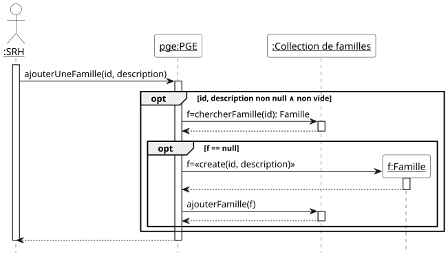

# Petits cadeaux pour Grands Effets

## 1. Spécification

### 1.1. Acteurs et cas d'utilisation

**La première étape** consiste à **bien comprendre le système** à
étudier. Dans le cadre de l'exercice, cela consiste à lire
attentivement l'énoncé. Cette lecture doit permettre de *délimiter les
contours du système* à réaliser. La méthode générale consiste à
retrouver les acteurs qui interagissent avec lui. Il est très
important de fixer des frontières au problème. Ensuite, nous
recherchons les fonctionnalités du système par la définition de ses
cas d'utilisation. Dans le cadre de ce module, il s'agit de rechercher
les principales fonctions attendues du système. Nous nous limitons aux
cas d'utilisation pour atteindre les premiers objectifs indiqués dans
le cahier des charges, en prenant en considération les simplifications
énoncées dans le cahier des charges.

Pour réaliser le diagramme de cas d'utilisation à partir de l'analyse
du texte :
* rechercher les acteurs, avec les potentielles relation de
  généralisation spécialisation,
* rechercher les fonctionnalités du système accessibles aux acteurs

Voici ci-dessous le diagramme de cas d'utilisation avec les cas
d'utilisation les plus importants puis un second diagramme de cas
d'utilisation avec des cas d'utilisation moins importants, et donc que
nous ne développerons pas dans le cadre du temps imparti.


### 1.2. Priorités, préconditions et postconditions des cas d'utilisation

Les priorités des cas d'utilisation sont choisies avec les règles de
bon sens suivantes:

* pour retirer une entité du système, elle doit y être. La priorité de
l'ajout est donc supérieure ou égale à la priorité du retrait ;

* pour lister les entités d'un type donné, elles doivent y être. La
priorité de l'ajout est donc supérieure ou égale à la priorité du
listage ;

* il est *a priori* possible, c.-à-d. sans raison contraire, de
démontrer la mise en œuvre d'un sous-ensemble des fonctionnalités du
système, et plus particulièrement la prise en compte des principales
règles de gestion, sans les retraits ou les listages ;

* la possibilité de lister aide au déverminage de l'application
pendant l'exécution des tests de validation ;

Par conséquent, les cas d'utilisation d'ajout sont *a priori* de
priorité « HAUTE », ceux de listage de priorité « Moyenne», et ceux de
retrait de priorité « basse ».

Voici les précondition et postcondition des cas d'utilisation de
priorité HAUTE.

#### Ajouter une famille (HAUTE)

- en entrée : identificateur de la famille, description
- en sortie : /

- précondition : \
∧ identificateur bien formé (non null ∧ non vide) \
∧ description bien formé (non null ∧ non vide) \
∧ pas de famille avec cet identificateur

- postcondition : \
∧ ajout de la famille effectué

#### Retirer une famille (HAUTE)

- en entrée : identificateur de la famille, description
- en sortie : /

- précondition : \
∧ identificateur bien formé (non null ∧ non vide) \
∧ description bien formé (non null ∧ non vide) \
∧ il existe une famille avec cet identificateur

- postcondition :
∧ retrait de la famille effectué

#### Ajouter un enfant (HAUTE)

- en entrée : identificateur de la famille, description, identificateur de l'enfant
- en sortie : /

- précondition : \
∧ identificateur famille bien formé (non null ∧ non vide) \
∧ description bien formé (non null ∧ non vide) \
∧ identificateur famille bien formé (non null ∧ non vide) \
∧ il existe une famille avec cet identificateur
∧ pas d'enfant dans cette famille avec cet identificateur

- postcondition :
∧ ajout de l'enfant dans la famille

#### Retirer un enfant (HAUTE)

- en entrée : 
- en sortie :

- précondition : \

- postcondition :

#### Ajouter un cadeau (HAUTE)

- en entrée : 
- en sortie :

- précondition : \

- postcondition :

#### Retirer un cadeau (HAUTE)

- en entrée : 
- en sortie :

- précondition : \

- postcondition :

#### Retirer un cadeau (HAUTE)

- en entrée : 
- en sortie :

- précondition : \

- postcondition :

#### AJouter une réservation d'un cadeau (HAUTE)

- en entrée : 
- en sortie :

- précondition : \

- postcondition :

#### Retirer une réservation d'un cadeau (HAUTE)

- en entrée : 
- en sortie :

- précondition : \

- postcondition :


#### Autres cas d'utilisation et leur priorité respective

- lister les familles (Moyenne)
- lister les enfants d'une famille (Moyenne)
- lister tous les enfants (Moyenne)

- lister le nombre de cadeaux disponibles (Moyenne)
- lister le nombre de points restants d'un enfant (Moyenne)
- lister le nombre de réservations pour un cadeau (Moyenne)

- lister les réservations réalisées (Moyenne)
- lister les cadeaux disponibles (Moyenne)

## 2. Préparation des tests de validation des cas d'utilisation

#### Ajouter une famille (HAUTE)

|                                                 | 1 | 2 | 3 | 4 |
|:------------------------------------------------|:--|:--|:--|---|
| identificateur bien formé (non null ∧ non vide) | F | T | T | T |
| description bien formée  (non null ∧ non vide)  |   | F | T | T |
| pas de famille avec cet identificateur          |   |   | F | T |
|                                                 |   |   |   |   |
| ajout de la famille effectué                    | F | F | F | T |
|                                                 |   |   |   |   |
| nombre de tests dans le jeu de tests            | 2 | 2 | 1 | 1 |

# 3. Conception

## 3.1. Listes des classes candidates et de leurs attributs

Voici les listes des classes candidates et de leurs attributs:
- `PGE` (mise en œuvre du patron de conception Façade) avec l'attribut
  `nBPointsMaxParEnfant` pour le nombre maximum de points par enfants
- `Famille` avec les attributs `identificateur` (pour identifier de
  manière unique un utilisateur) et `description`

## 3.2. Premières opérations des classes

Les seules opérations que nous connaissons déjà sont celles
correspondant aux cas d'utilisation. Comme nous utilisons le patron de
conception Façade, toutes les opérations des cas d'utilisation sont
dans la Façade.

Donc, dans la classe `PGE`, voici les premières opérations (en
ignorant celles de priorité « basse ») :
- `ajouterUneFamille`
- `retirerUneFamille`
- `listerLesFamilles`

## 3.3. Diagramme de classes (version conception détaillée)

Le diagramme de classes obtenu lors d'une analyse à partir de l'énoncé
du problème est donné dans la figure qui suit. Dans ces diagrammes,
les opérations ne sont pas mentionnées par souci de simplification.

**Important: même dans les diagrammes de la conception détaillée, on
ne montre pas les attributs traduisant des associations.**

Version sans les notifications :


## 3.4. Diagrammes de séquence

#### Ajouter une famille (HAUTE)

Le premier diagramme a notre préférence.




# 7. Diagrammes de machine à états et invariants, et fiche des classes

Dans les diagrammes de machine à états, nous faisons le choix de faire
apparaître les états de création et de destruction. Ces états sont
transitoires, il est vrai, mais ils méritent cependant une attention
particulière.  L'état de création, en particulier, donne lieu, lors de
la réalisation dans un langage de programmation orienté objet, à
l'écriture d'une opération « constructeur » qui garantit que
tous les attributs sont initialisés correctement dès la création d'une
instance. Nous savons également qu'en JAVA la destruction se réalise
en « oubliant » l'objet : un mécanisme de ramasse
miettes détruit automatiquement les objets lorsqu'ils ne sont plus
référencés. Il n'en est pas de même dans tous les langages, et par
exemple en C++ qui ne possède pas de mécanisme de ramasse miettes, la
destruction des objets peut s'avérer un casse tête ardu.

Les actions provoquées par des appels en provenance d'autres objets
apparaissent sur les transitions. Nous avons gardé comme action
interne uniquement les actions correspondant à des appels que l'objet
fait seul ou fait de manière répétitive.  Les constructeurs et
destructeurs sont des exceptions (ils apparaissent en interne bien
qu'étant déclenchés par un autre objet).

## 7.1. Classe Famille

### 7.1.1. Diagramme de machine à états

Trivial et non dessiné pour l'instant.

### 7.1.2. Fiche de la classe Famille

Voici tous les attributs de la classe :
```
— id: String
— description: String
```

N.B. : la liste est à compléter.

### 7.1.3. Invariant de la classe Famille

```
  id != null ∧ !id.isBlank()
∧ description != null ∧ !description.isBlank()
```

N.B. : l'invariant est à compléter

# 8 Préparation des tests unitaires

## 8.1. Opérations de la classe Famille

### Opération constructeur

|                                                 | 1   | 2   | 3   |
|:------------------------------------------------|:----|:----|:----|
| identificateur bien formé (non null ∧ non vide) | F   | T   | T   |
| description bien formée (non null ∧ non vide)   |     | F   | T   |
|                                                 |     |     |     |
| identificateur' = identificateur                | F   | F   | T   |
| description' = description                      | F   | F   | T   |
|                                                 |     |     |     |
| levée d'une exception                           | oui | oui | non |
|                                                 |     |     |     |
| nombre de tests dans le jeu de tests            | 2   | 2   | 1   |

---
FIN DU DOCUMENT
